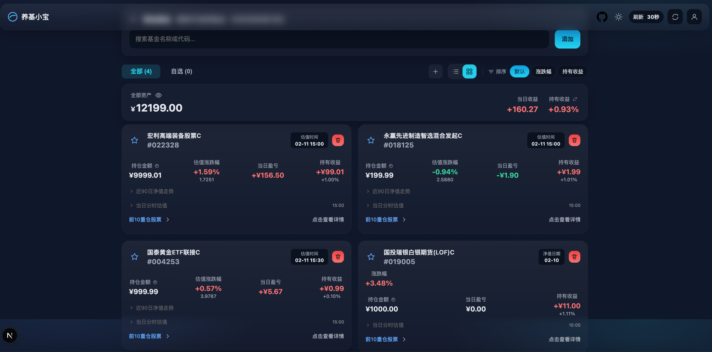
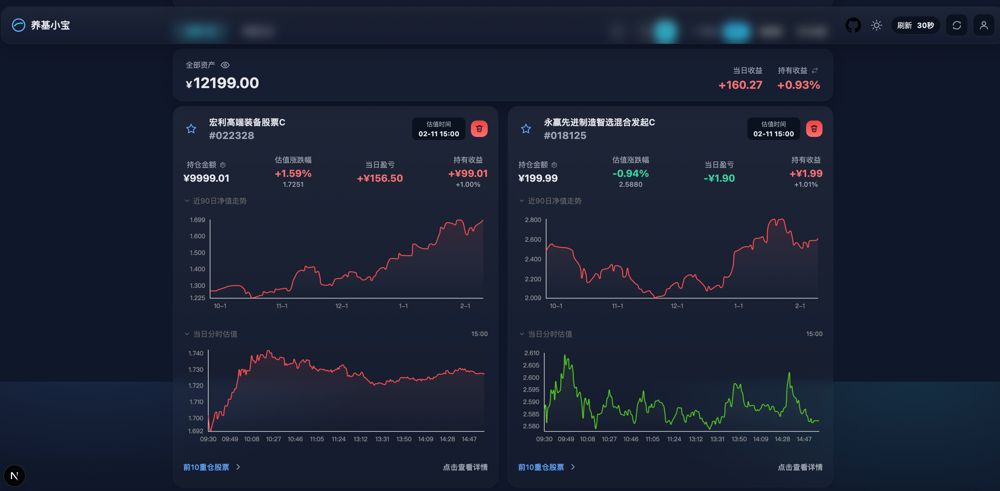

# 养基小宝 - 实时基金估值

在线预览地址: [https://fund-baby.ningzhengsheng.cn/](https://fund-baby.ningzhengsheng.cn/)

一个基于 Next.js 的纯前端基金估值与持仓管理工具，支持基金搜索、实时估值、重仓股查看、持仓记录、分组、自选、导入导出和本地持久化。




## 使用说明

1. 添加基金：在顶部搜索框输入基金名称或 6 位基金代码，点击“添加”。
2. 查看详情：卡片支持查看估值、净值、涨跌幅、持仓收益和重仓股。
3. 管理持仓：支持加仓、减仓、编辑持仓、清空持仓和待处理交易。
4. 数据管理：支持自选、分组、导入配置、导出配置。
5. 本地保存：所有数据默认保存在当前浏览器本地存储。

## 特性

- 实时估值：通过公开接口获取基金估值、净值和涨跌幅数据。
- 重仓股追踪：展示基金前 10 大重仓股，并尝试补充行情涨跌数据。
- 本地持久化：使用 `localStorage` 保存基金列表、设置、持仓和交易数据。
- 响应式界面：适配桌面端和移动端。
- 自定义刷新：支持设置自动刷新频率，并提供手动刷新按钮。
- 导入导出：支持将本地配置导出为 JSON，并从 JSON 导入。

## 技术栈

- 框架：Next.js
- 语言：TypeScript
- 动画：framer-motion
- 图表：ECharts
- 日期处理：dayjs
- 样式：全局 CSS

## 本地开发

1. 克隆仓库

```bash
git clone https://github.com/zhengshengning/fund-baby.git
cd fund-baby
```

2. 安装依赖

```bash
npm install
```

3. 当前版本默认仅使用浏览器本地存储，无需额外环境变量。

4. 启动开发服务器

```bash
npm run dev
```

访问 [http://localhost:3000](http://localhost:3000) 查看效果。

## 构建

```bash
npm run build
```

## Docker

```bash
docker build -t fund-baby .
docker run -d -p 3000:3000 --name fund fund-baby
```

或使用：

```bash
docker compose up -d
```
